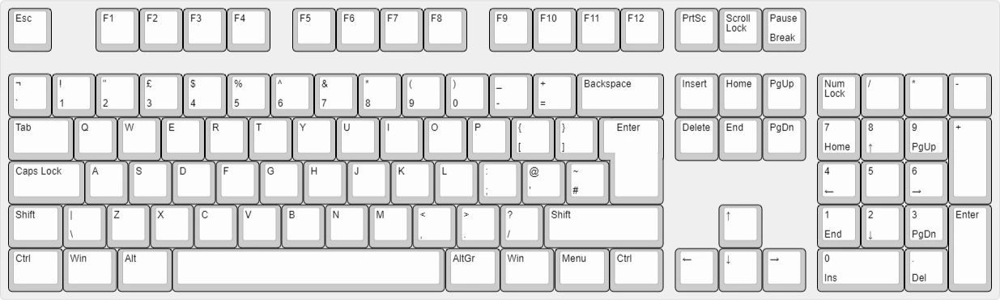
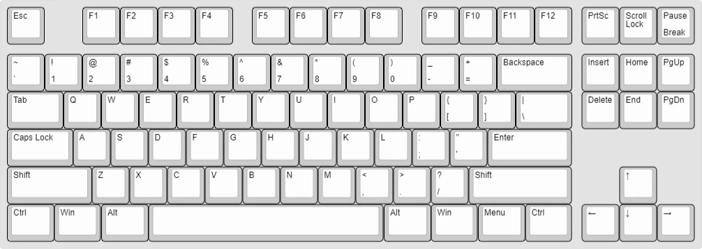
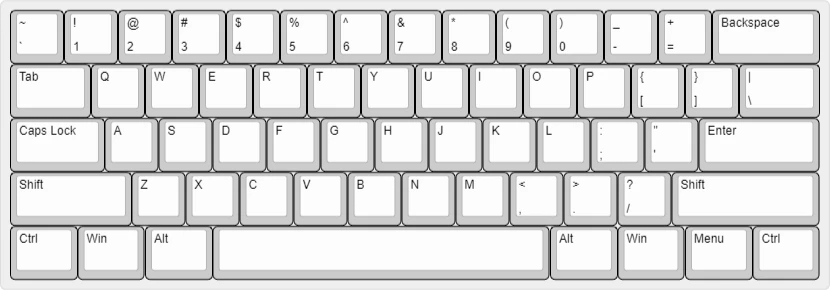

## ISO vs ANSI

## 100% ANSI Layout
> Full-size keyboards come with the traditional modifiers, arrow keys, and numpad.

## 100% ISO Layout

## TKL (Tenkeyless)
> Like a full-size board, but without the numpad. This form factor is fairly standardized without much variation with the directional keys.

## 9800 Layout

## 1800 Layout
> This full-size layout is a bit more compact than its standard counterpart—the navigation cluster has moved to sit above the numpad, allowing the clusters to shift a bit closer together.

## 96-Key Layout

## 75% ANSI Layout
> 75% boards compact the keys tightly together, fitting nearly as many keys as a TKL.
> AKA: a 65% with a function row

## 65% Layout
> A 65% has alphas, modifiers, and an extra right column to accommodate arrow keys. 
> AKA: a 75% without the function row or a 60% with arrow keys.

## 60% ANSI
>A 60% keyboard is a common “compact” layout. It omits the numpad, arrow keys, and function row.

## 60% ISO
> A 60% keyboard is a common “compact” layout. It omits the numpad, arrow keys, and function row.

## 40% Layout
> 40% boards contain alphas—with no number row—and some modifiers. They rely on programmed layers for functionality.

