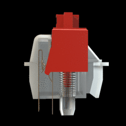
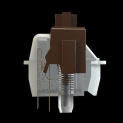

# Mechanical Switches

## Linear

Linear switches are the most straightforward out of all switch types. This type of mechanical keyboard switch offers no feedback or clicking sounds as there is nothing in between the moment you press the key and the actuation point. This allows for a smoother and faster actuation per key press. Linear switches are the preferred mechanical keyboard switches for most gamers.

## Clicky

Clicky switches are the total opposite of linear switches. Not only do they provide tactile feedback between the moment of pressing and the actuation point but they also feature a distinct clicking sound after each key press (hence the name) as compared to the silent nature of linear switches. This type of switch is mainly for those who enjoy the clicking sound when they type.

## Tactile

Tactile switches work similarly to clicky switches as they provide the same tactile feedback or a “bump” when pressed minus the clicking sound. Both tactile switches and clicky switches register a key press without needing the user to press each key all the way down (AKA bottoming out) which is great for typing.