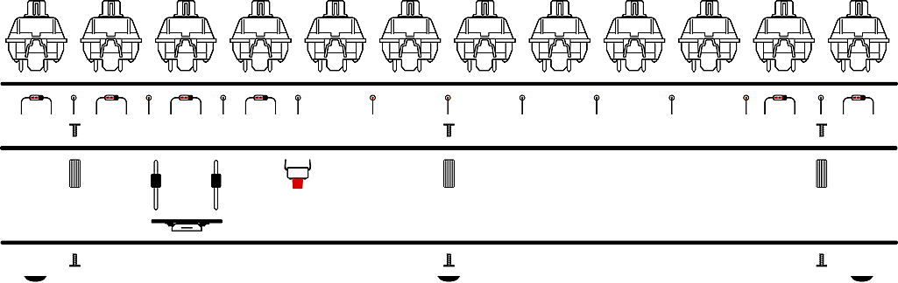

# Build Steps

1. Prepare Diodes
2. Install Diodes
3. Solder Pro Micro Headers & Reset Button
4. Install Stabilizer (Optional)
5. Screw on Standoffs
6. Solder Switches
7. Install Pro Micro Controller
8. Screw on Bottom Plate

## 1. Prepare Diodes

Cut 48 diodes from the included strip. Bend the diode pins 90 degrees (as shown in illustration).

## 2. Install Diodes

Install diodes to the top of the PCB. Solder diode pins where they stick out of the bottom of the PCB. 48 diodes must be used for all switches to function.

:::info
Diodes are direction sensitive. Be sure to install all diodes with the black side aligned to the side with the square solder pad and line through the diode outline (as shown in illustration).
:::

## 3. Solder Pro Micro Headers & Reset Button

Install Pro Micro headers so that shorter pins are in the PCB and black plastic is on the bottom of the PCB. Solder pins where they stick out of the top of the PCB.

Install reset button to the bottom of the PCB. Solder reset button pins where they stick out of the top.

:::info
Do not install the Pro Micro itself until Step 7.
:::

## 4. Install Stabilizer (Optional)

Install a stabilizer for spacebars if used.

:::info
Only Cherry-style PCB mount stabilizers can be used.
:::

## 5. Screw on Standoffs

Install 5 screws and standoffs to the PCB, so that the standoffs are on the bottom (the same side as the Pro Micro legs).

## 6. Solder Switches

Starting from the outer corners, install all switches by snapping them in to top switch plate and then pressing the pins through the top of the PCB. Solder metal switch pins on the bottom of the PCB where they stick through.

## 7. Install Pro Micro Controller

Install the Pro Micro on to the bottom of the PCB so that the components face down (away from the PCB).

Solder pins to Pro Micro where they stick through. Take care to prevent or remove any solder bridges (solder connecting one pin to another) that may form.

## 8. Screw on Bottom Plate

Screw the bottom plate to the standoffs you installed earlier.

(Optional) Install the provided self-adhesive rubber bumpon feet to the bottom plate.

:::info
Ensure the reset hole on the bottom plate aligns with the reset switch on the PCB.
:::

All Done!

Install your choice of keycaps on to the switches, plug in the USB cable to the keyboard and your computer, and you’re good to go!
