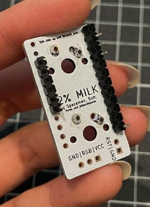

# Build Steps

### 1: Solder the Mill-Max Hotswap Sockets
Solder in the mill max sockets: insert them into the correct holes (ensure the ‘lip’ is facing the correct side).

Tape them down on the front side of the pcb using some masking/electrical tape, flip over and solder them on the back.

### 2: Solder the header pins for the Pro Micro
It's not necessary to solder all pins.  
Solder in the headers: separate the headers into a 6-pin length one (aka break a 12-pin one in half) and a 12-pin length. remove the middle 2 pins in the 6-pin header, and remove the 1st, 4th-11th pin in the 12-pin header.

Insert the headers into the pcb and ensure the plastic is on the back side of the pcb.

Solder the pins on the front side.

### 3: Install the Pro Micro to the back of the 3d printed case
Solder in the pro micro: align the holes correctly on the pro micro and solder on the back side of the pcb.

This should be: 

(on the left) GND, GND, 4, 5 

(on the right) GND, RST, VCC, 10

### 4: Trim the header pins
Clip the pins shorter off the front.

### 3: Install the switches to the 3d printed case
This can be difficult to do especially if your switch legs are thick. 

The easiest way to do it is to install ONE switch, click it into the mill maxed pcb, and then install the second switch after.

