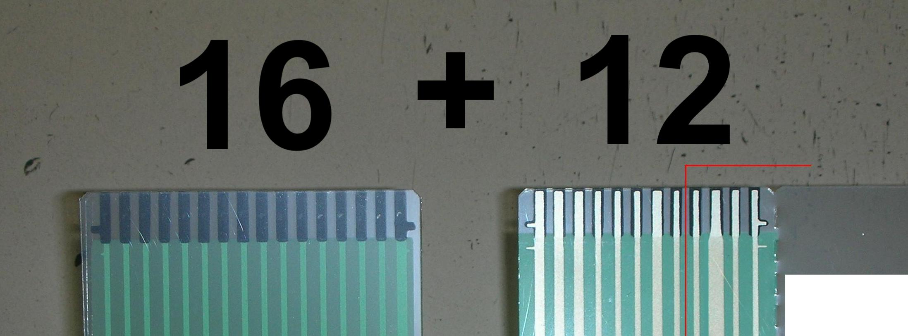

# Variants
The Model H comes in two variants, each meant to fit different versions of the Model M keyboard. The difference between these is the number of flexible connectors and the number of pins on each.

Please open your keyboard to make sure the connectors you order match what's inside your keyboard.
16 + 8 + 4

16 columns + 8 rows + 4 LEDs

These connectors were used for all keyboards before 1991, and some in the early 90s.

This should also work for keyboards without LEDs (assuming they use the 16+8 connectors).
16 + 12

16 columns + 12 rows and LEDs combined

This connector configuration was introduced in 1991 and was used for most (but not all) keyboards after that. 