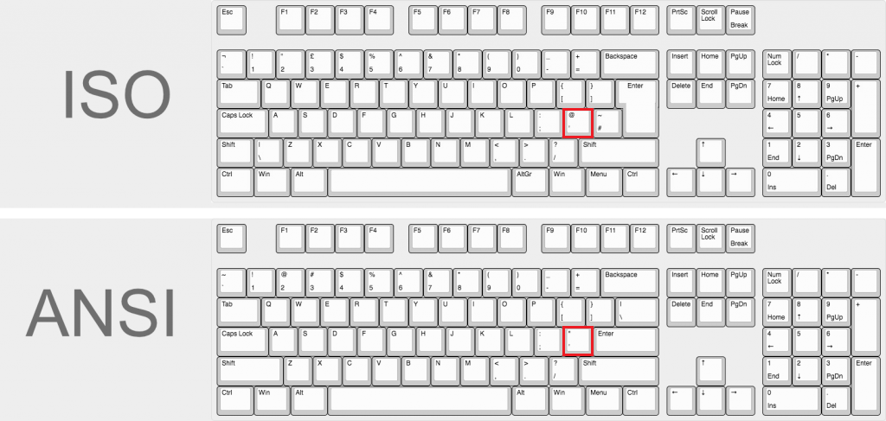
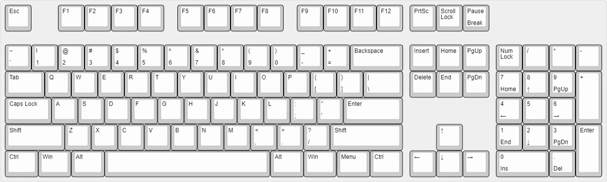
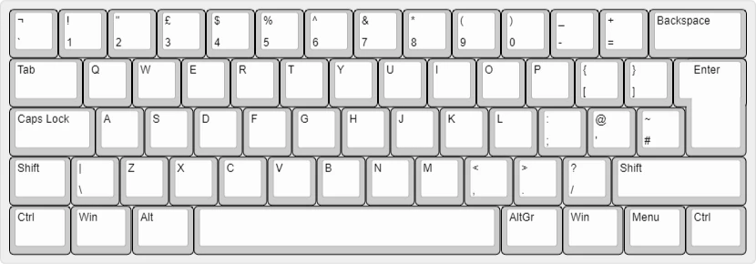

# Keyboard Layouts

## ISO vs ANSI

## 100% ANSI
> Full-size keyboards come with the traditional modifiers, arrow keys, and numpad.

## 100% ISO

## TKL (Tenkeyless)
> Like a full-size board, but without the numpad. This form factor is fairly standardized without much variation with the directional keys.

## 1800
> Traditional 1800 - These will have blockers between arrow cluster, numpad, and/or navigation cluster.

## 96% ANSI
> 96% or 96 - This a compact layout that often have 96-98 key there are no blockers between the arrow cluster, numpad and function rows

## 75% ANSI
> 75% boards compact the keys tightly together, fitting nearly as many keys as a TKL.
> AKA: a 65% with a function row

## 65% ANSI
> A 65% has alphas, modifiers, and an extra right column to accommodate arrow keys. 
> AKA: a 75% without the function row or a 60% with arrow keys.

## 60% ANSI
>A 60% keyboard is a common “compact” layout. It omits the numpad, arrow keys, and function row.

## 60% ISO
> A 60% keyboard is a common “compact” layout. It omits the numpad, arrow keys, and function row.

## 40% ANSI
> 40% boards contain alphas—with no number row—and some modifiers. They rely on programmed layers for functionality.

